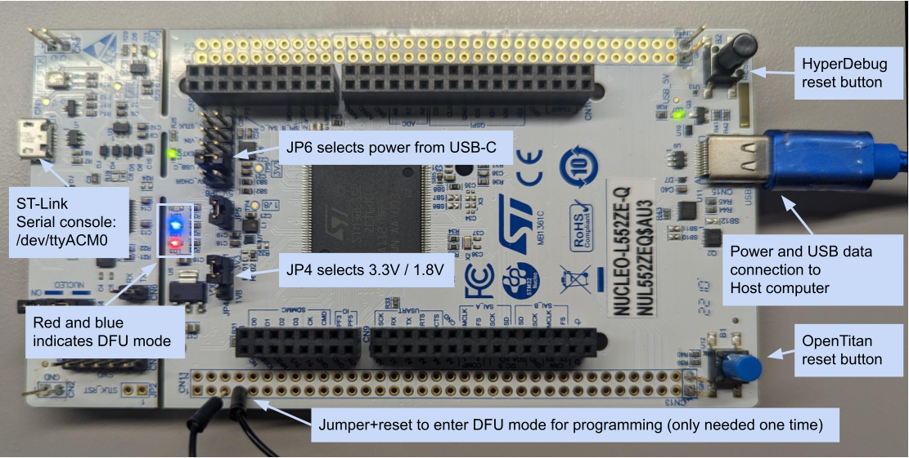

# HyperDebug

HyperDebug is our name for a [STM NUCLEO L552ZE board][Nucleo board] flashed with [this configuration][HD firmware] of ChromeOS's EC firmware.

We use these boards during testing to connect to OpenTitan's peripherals.
They can be used for bootstrapping OpenTitan over SPI, sending and receiving UART messages, checking GPIOs, debugging over JTAG, etc.

[Nucleo board]: https://www.st.com/en/evaluation-tools/nucleo-l552ze-q.html
[HD firmware]: https://github.com/lowRISC/hyperdebug-firmware

## Provisioning a Nucleo board

We need to set some jumpers and flash the HyperDebug firmware on the Nucleo boards before using them for OpenTitan testing.



### Connecting to the board

Your user must have access to the HyperDebug board in order to program and use it.
We provide a udev rule file which covers the FPGA boards, debuggers, and HyperDebug board [here][udev].

To install these rules from the OpenTitan repository:

```sh
sudo cp ./doc/getting_started/data/90-opentitan.rules /etc/udev/rules.d/
sudo udevadm control --reload-rules
sudo udevadm trigger
```

[udev]: ./data/90-opentitan.rules

### Jumper configuration

The following jumpers on the board should be set:

1. JP6: select power from USB-C.
2. JP4:
   * select 1.8V when connected to the CW340 board.
   * select 3.3V when connected to the CW310 and teacup boards.

### Flashing firmware

To flash the firmware:

1. Short pins 5 and 7 of CN11 with a jumper cable and press the black reset button to enter DFU mode.
   The red and blue LEDs should now be lit.

2. Run the following command from the OpenTitan repository:

   ```sh
   bazel run //sw/host/opentitantool -- \
     --interface hyperdebug_dfu \
     transport update-firmware
   ```

3. Run `lsusb` and check for `Google Inc. HyperDebug CMSIS-DAP` to ensure it flashed correctly.
